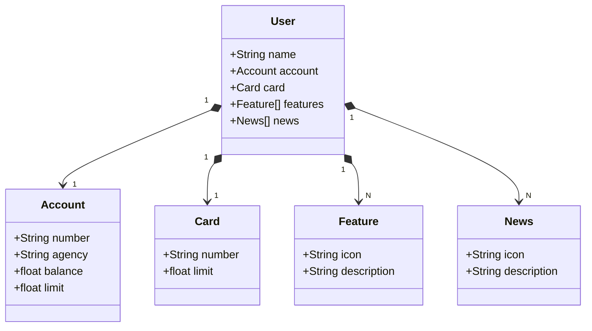

# API para o app Santander Dev Week 2024

O objetivo dessa aplicação é criar uma backend para o aplicativo do santander baseado na tela inicial que contem informacoes como conta, saldo e alguns banners de acordo com a imgame.

## Diagrama de classes

## Abstração

Com a imagem chegamos a esse diagrama de classes acima em que agora precisamos implementa-lo de forma a resgatar esses objetos de um banco de dados para exibir ao cliente em sua tela inicial.

## Tecnologias usadas

Neste projeto fizemos o projeto Gradle com seus recursos em um .yml na pasta respectiva. Dessa forma podemos implementar a aplicação quer fará a criação de um objeto conta e o recuperará através de seu ID definido na classe do objeto. O banco de dados utilizado nesse momento foi o H2 por ser um banco em memoria ideal para teste de aplicação no formato SQL com integração pela persistencia JPA do Java. Assim utilizamos o principio SOLID em nossa implementação do serviço, pois o codigo não fica exposto ao usuario caso ocorra algum erro ou algo parecido.

